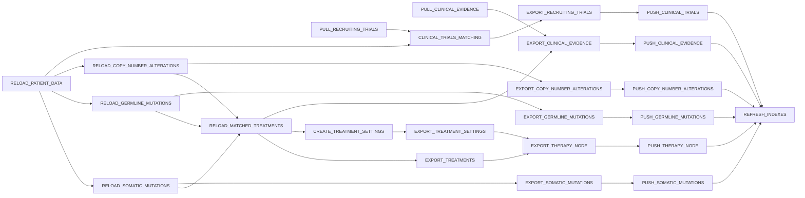

# Task Orchestrator

DAG-based task executor with dependency-aware scheduling, parallel task execution, explicit task state transitions, cascade failure handling, and Celery dispatch.

This is a reference project and the codebase can be used as a template or boilerplate for a Python task orchestrator, or as a starting point for a Svelte web app that needs a server-backed task orchestration UI.

Each **Scope** owns a **Job** — a directed acyclic graph of **Tasks**. Scheduling a task marks it and all downstream tasks for (re-)execution. Tasks execute in parallel where dependencies allow. See [CONTEXT.md](CONTEXT.md) for the domain glossary.

## Stack

Python 3.13 · FastAPI · PostgreSQL · SQLAlchemy 2 · Alembic · Celery · Redis · TypeScript · Svelte 5 · Docker

## Quickstart

### Docker (full stack)

```bash
cp .env.example .env
docker compose up --build
```

Client available at `http://localhost:5173`. 

API available at `http://localhost:8000/api` — interactive docs at `http://localhost:8000/docs`.

Full-stack smoke path:

1. Open `http://localhost:5173`.
2. The demo Scope initializes automatically and renders the Task DAG canvas.
3. Use **Refresh** to reload the graph, or **Stop Run** to
  stop pending and in-progress work for the Scope.
4. Pan and zoom the Svelte Flow DAG canvas. Select a Task node to open the
  inspector drawer with Task-specific actions, launch details, dependencies, and journal entries.

Useful container commands:

```bash
docker compose ps
docker compose logs api
docker compose logs client
docker compose logs worker
docker compose down
```

### Local dev

**Prerequisites:** pnpm 10, Python 3.13, uv, PostgreSQL, Redis running locally.

Install the root workspace once:

```bash
pnpm install
```

pnpm orchestrates workspace commands from the repository root. Python dependency management still belongs to `uv` inside `apps/server`; the pnpm server package only delegates commands into that uv-managed workspace.

```bash
# Install server dependencies
pnpm --filter @task-orchestrator/server exec uv sync

# Copy and edit env for local services
cp .env.example apps/server/.env

# Run migrations
pnpm --filter @task-orchestrator/server exec uv run alembic upgrade head

# Start API server
pnpm run dev:server

# Start browser client (separate terminal)
pnpm run dev:client

# Start Celery worker (separate terminal)
pnpm run dev:worker

# Start Celery beat scheduler (separate terminal)
pnpm run dev:beat
```

Local browser client: `http://localhost:5173`. During local development Vite proxies `/api` to `http://localhost:8000`, so the client uses the same relative API boundary as the containerized setup.

## Workspace Commands

Run shared commands from the repository root:

```bash
pnpm run format       # Biome for client/shared files, Ruff format for server
pnpm run lint         # Biome + Oxlint for client/shared files, Ruff for server
pnpm run typecheck    # TypeScript for client/shared files, Pyright for server
pnpm run test         # Client Vitest suite and server tests
pnpm run api:generate # Write docs/api/openapi.json and generated client contract
pnpm run check        # Full format, lint, typecheck, test, and API generation
```

## API


| Method   | Path                                                                  | Description                                        |
| -------- | --------------------------------------------------------------------- | -------------------------------------------------- |
| `POST`   | `/api/scopes/{scope_id}`                                              | Create a job for a scope (returns 409 if exists)   |
| `GET`    | `/api/scopes/{scope_id}/tasks`                                        | List all tasks with current status                 |
| `POST`   | `/api/scopes/{scope_id}/tasks/{task_id}/schedule`                     | Schedule task + all downstream, dispatch to Celery |
| `DELETE` | `/api/scopes/{scope_id}/run`                                          | Stop all pending and in-progress work for a scope  |
| `DELETE` | `/api/scopes/{scope_id}/tasks/{task_id}/launches/{launch_id}`         | Abort a running launch                             |
| `GET`    | `/api/scopes/{scope_id}/tasks/{task_id}/launches/{launch_id}/journal` | Fetch execution logs                               |


## Demo task graph and console

The demo graph is loaded from `apps/server/task_orchestrator/infrastructure/fs/task_specifications.yml`.

Representative report-preparation Tasks are wired as a DAG to exercise parallel dispatch, fan-in, downstream invalidation, and finalization:




The client renders this server-backed graph with Svelte Flow. It uses a deterministic Dagre layout, groups parallel branches into subflow containers, highlights selected upstream/downstream paths, greys unrelated Tasks, and uses animated dashed outgoing edges for pending Tasks.

Task-specific actions live in the inspector drawer:

- **Schedule** schedules the selected Task and its downstream subgraph.
- **Open Journal** shows the selected launch journal.
- **Abort Launch** is available for a selected Task launch that can still be aborted.

## Demo task handlers

The Celery runner registers a demo handler for every `TaskSpecificationId`.
These handlers do not call external systems, but they simulate realistic work:

- runtime defaults to a deterministic 10-15 seconds per Task, configurable with
`DEMO_TASK_MIN_SECONDS` and `DEMO_TASK_MAX_SECONDS`;
- journal records describe the Task phase, such as loading, fetching, serialising, publishing, synchronising, or configuring;
- each Task emits a JSON `FileLogRecord`, persisted in the `log_files` table alongside the journal row.

## Tests

```bash
pnpm run test
```

Unit tests need no external services — SQLite in-memory used for integration tests.

Coverage report:

```bash
cd apps/server
uv run coverage run -m pytest tests/ && uv run coverage html
# open htmlcov/index.html
```

## Code quality

```bash
pnpm run lint:fix
pnpm run typecheck
pnpm run check
```

## Database migrations

Generate a migration after changing ORM models:

```bash
cd apps/server
uv run alembic revision --autogenerate -m "describe change"
uv run alembic upgrade head
```

## Adding a real task handler

1. Implement `TaskHandlerInterface` in `task_orchestrator/handlers/`:

```python
from task_orchestrator.domain.journal import Log
from task_orchestrator.handlers.interface import TaskHandleStatus

class MyHandler:
    def run(self, scope_id: str) -> tuple[TaskHandleStatus, list[Log]]:
        # do work...
        return TaskHandleStatus.SUCCESS, []
```

1. Register it in `task_orchestrator/infrastructure/celery/runner.py`. The
  current demo registry stores factories because demo handlers receive a  runtime duration from the runner:

```python
_HANDLERS = {
    TaskSpecificationId.RELOAD_PATIENT_DATA: lambda _runtime_seconds: MyHandler(),
    # ...
}
```

1. Add the task ID to `TaskSpecificationId` in
  `task_orchestrator/domain/task.py`.
2. Add or update the visible demo DAG entry in
  `task_orchestrator/infrastructure/fs/task_specifications.yml`.

